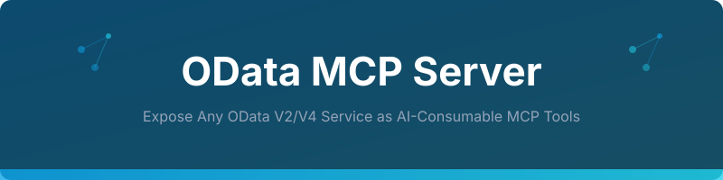

<p align="center">
  
</p>

# OData MCP Server

[](https://www.python.org/downloads/)
[](https://modelcontextprotocol.io/)
[](LICENSE)

**Connect any OData V2/V4 service to any LLM through the Model Context Protocol.**

Turn every OData API into a set of LLM-callable tools — automatically. Point it at a `$metadata` endpoint, and it generates MCP tools for every entity set, with typed parameters, filters, and expansions.

```
LLM (Claude, GPT, etc.)
  ↕ MCP Protocol
OData MCP Server
  ↕ HTTP/OData
Any OData Service (Microsoft Graph, Dynamics 365, SAP, Salesforce, etc.)
```

## Why This Exists

OData is the most widely used API standard in enterprise software — Microsoft Graph, Dynamics 365, SharePoint, SAP, Salesforce, and hundreds of others expose OData APIs.

But connecting an LLM to an OData service today means:
- Writing custom tool definitions for every entity
- Handling V2 vs V4 differences manually
- Parsing `$metadata` XML yourself
- Building `$filter`, `$select`, `$expand` queries by hand

This server does all of that **automatically**.

## Quick Start

```bash
# Install
pip install odata-mcp-server

# Or from source
git clone https://github.com/naveenkumarbaskaran/OData-MCP-Server.git
cd OData-MCP-Server
pip install -e .

# Run
odata-mcp --endpoint https://services.odata.org/V4/Northwind/Northwind.svc
```

### Claude Desktop Config

```json
{
  "mcpServers": {
    "odata": {
      "command": "odata-mcp",
      "args": ["--endpoint", "https://services.odata.org/V4/Northwind/Northwind.svc"]
    }
  }
}
```

Now ask Claude: *"Show me all products with unit price over 20"* — it calls the auto-generated `query_Products` tool with `$filter=UnitPrice gt 20`.

## Features

### Auto-Discovery from $metadata

```bash
odata-mcp --endpoint https://example.com/odata/v4
# Reads $metadata → generates tools for every entity set
# Products → query_Products, get_Products_by_key
# Orders → query_Orders, get_Orders_by_key
# Customers → query_Customers, get_Customers_by_key
```

### Typed Parameters

The server parses EDM types from metadata and generates proper tool schemas:

```json
{
  "name": "query_Products",
  "parameters": {
    "filter": {"type": "string", "description": "$filter expression (e.g., 'Price gt 100')"},
    "select": {"type": "string", "description": "Comma-separated fields to return"},
    "expand": {"type": "string", "description": "Navigation properties to expand"},
    "top": {"type": "integer", "description": "Max results (default: 20)"},
    "orderby": {"type": "string", "description": "Sort expression"}
  }
}
```

### V2 and V4 Support

| Feature | V2 | V4 |
|---------|----|----|
| $filter | ✅ | ✅ |
| $select | ✅ | ✅ |
| $expand | ✅ (flat) | ✅ (nested) |
| $orderby | ✅ | ✅ |
| $top / $skip | ✅ | ✅ |
| $count | ❌ | ✅ |
| $search | ❌ | ✅ |
| JSON responses | ✅ (with `$format=json`) | ✅ (default) |

### Authentication

```bash
# Basic auth
odata-mcp --endpoint https://example.com/odata --auth basic --user admin --password secret

# Bearer token
odata-mcp --endpoint https://example.com/odata --auth bearer --token eyJhbG...

# OAuth2 client credentials
odata-mcp --endpoint https://example.com/odata --auth oauth2 \
  --client-id abc --client-secret xyz --token-url https://auth.example.com/token

# No auth (public services)
odata-mcp --endpoint https://services.odata.org/V4/Northwind/Northwind.svc
```

### Smart Caching

Metadata is cached locally (default 1 hour) so the server starts fast:

```bash
odata-mcp --endpoint https://example.com/odata --cache-ttl 3600
```

## Architecture

```
┌──────────────────────────────────────────────┐
│                  MCP Client                   │
│              (Claude, GPT, etc.)              │
└─────────────────────┬────────────────────────┘
                      │ MCP Protocol (stdio/SSE)
                      ▼
┌──────────────────────────────────────────────┐
│              OData MCP Server                 │
│                                              │
│  ┌─────────────┐  ┌──────────────────────┐  │
│  │  Metadata    │  │   Tool Generator     │  │
│  │  Parser      │──│   (auto from EDMX)   │  │
│  │  (V2 + V4)  │  └──────────┬───────────┘  │
│  └─────────────┘             │               │
│                    ┌─────────▼───────────┐   │
│                    │   Query Builder     │   │
│                    │   ($filter, $expand) │   │
│                    └─────────┬───────────┘   │
│                    ┌─────────▼───────────┐   │
│                    │   HTTP Client       │   │
│                    │   (auth, retry,     │   │
│                    │    rate limit)      │   │
│                    └─────────────────────┘   │
└──────────────────────────────────────────────┘
```

## Advanced Usage

### Entity Filtering

Only expose specific entity sets:

```bash
# Only Products and Orders
odata-mcp --endpoint https://example.com/odata --include Products,Orders

# Everything except AuditLogs
odata-mcp --endpoint https://example.com/odata --exclude AuditLogs
```

### Read-Only Mode

```bash
# Only generate query/read tools (no create/update/delete)
odata-mcp --endpoint https://example.com/odata --read-only
```

### Custom Tool Names

```yaml
# config.yaml
tools:
  Products:
    name: search_products
    description: "Search product catalog"
  Orders:
    name: find_orders
    description: "Find customer orders"
```

```bash
odata-mcp --endpoint https://example.com/odata --config config.yaml
```

## Testing

```bash
# Run tests
pytest tests/ -v

# Test against public OData services
pytest tests/test_integration.py -v --live
```

## Supported OData Services (Tested)

| Service | Version | Status |
|---------|---------|--------|
| [OData.org Northwind](https://services.odata.org/V4/Northwind/Northwind.svc) | V4 | ✅ |
| [OData.org TripPin](https://services.odata.org/TripPinRESTierService) | V4 | ✅ |
| [Microsoft Graph](https://graph.microsoft.com/v1.0) | V4 | ✅ |
| Any OData V2/V4 endpoint | V2/V4 | ✅ |

## License

MIT
